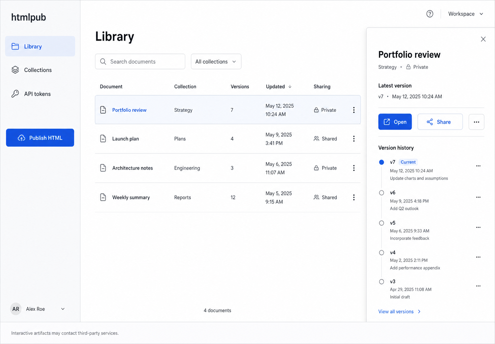

# htmlpub

htmlpub is a private publishing workspace for self-contained interactive HTML reports. It provides an authenticated Next.js dashboard, immutable version history, revocable latest-version share links, an isolated renderer, and an installable Node CLI.



## Repository layout

- `apps/web`: Clerk-authenticated dashboard, versioned HTTP interface, share pages, and cleanup cron.
- `apps/renderer`: cookie-free HTML streaming origin with signed five-minute render tickets and restrictive sandbox headers.
- `packages/core`: validation, security primitives, render tickets, and the two-phase publishing module.
- `packages/db`: Drizzle schema, Neon adapter, and generated SQL migrations.
- `packages/cli`: the `htmlpub` npm command.

## Local development

Requirements: Node 20.9 or later and pnpm 10.

```bash
pnpm install
copy .env.example .env.local
pnpm db:migrate
pnpm dev
```

The web app runs at `http://localhost:3000`; the renderer runs at `http://localhost:3001`.

Local development uses the same Clerk, Neon, and private Blob resources as deployment. No mock data or alternate publishing path is included.

## Production setup

1. Create a Neon Postgres integration and a private Vercel Blob store from the Vercel Marketplace.
2. Create two Vercel projects from this repository. Set their root directories to `apps/web` and `apps/renderer`.
3. Connect the same Neon database and private Blob store to both projects.
4. Configure Clerk only on the web project. Disable public signups and set `OWNER_CLERK_USER_ID` to the single allowed user.
5. Set a shared, random `RENDER_TICKET_SECRET` on both projects. Set `NEXT_PUBLIC_RENDERER_ORIGIN` on web and `APP_ORIGIN` on renderer to the deployed origins.
6. Set `CRON_SECRET` on web. Vercel invokes `/api/cron/cleanup-uploads` daily at 03:17 UTC.
7. Run `pnpm db:migrate` with the production `DATABASE_URL`, then deploy the renderer and web projects.

Use a different registered origin for the renderer. It must not receive Clerk configuration or application cookies.

## Publishing interface

```text
POST /api/v1/uploads
PUT  <short-lived private Blob URL>
POST /api/v1/uploads/{uploadId}/complete
```

Upload initiation validates a UTF-8 `.html` file declaration, creates an expiring session, and returns a ten-minute Blob URL restricted to one immutable pathname, `text/html`, and the declared size. Completion inspects Blob metadata before transactionally allocating the next version number. Repeating completion is idempotent.

Share tokens are 256-bit bearer secrets stored only as SHA-256 hashes. Creating a new link revokes the previous link because the original secret cannot be recovered. A share page resolves the current version and sends only a five-minute render ticket to the renderer.

## CLI

```bash
pnpm --filter @htmlpub/cli build
pnpm --filter @htmlpub/cli link --global
htmlpub --json doctor
htmlpub auth login --endpoint https://your-web-project.vercel.app
htmlpub publish ./report.html --collection Planning
htmlpub share report
```

See [`packages/cli/README.md`](packages/cli/README.md) for the command and JSON contracts.

## Verification

```bash
pnpm test
pnpm typecheck
pnpm lint
pnpm build
pnpm --filter @htmlpub/cli pack:check
```

`pnpm db:generate` verifies the Drizzle schema and regenerates migrations after intentional schema changes. Applying a migration requires a real database and is deliberately separate from the default test suite.

## Security properties

- Uploaded HTML never runs in the authenticated app origin.
- Private Blob URLs and permanent share tokens are never exposed to artifacts.
- The renderer has no Clerk dependency, emits no application cookies, uses `Referrer-Policy: no-referrer`, and limits `frame-ancestors` to the app origin.
- The iframe and response CSP allow scripts, downloads, and user-initiated links but omit same-origin, forms, storage access, and top navigation.
- External HTTPS assets are allowed. They can observe viewer network metadata, which is disclosed in the UI.
- API tokens are named, scoped, hashed, shown once, and revocable.
